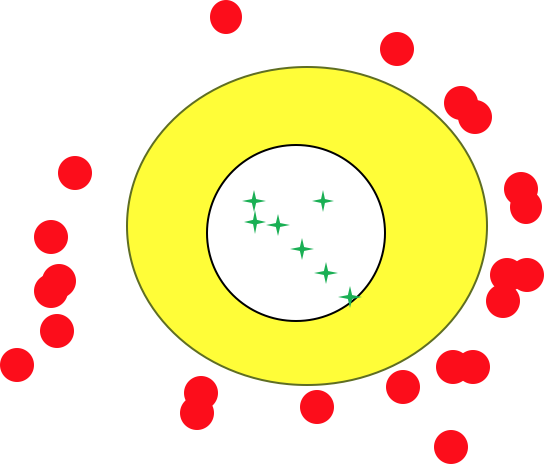

# 第一章：绪论

  

### 1.基本术语

> 要进行机器学习，先要有数据。

*假设现在有一个西瓜，色泽青绿、根蒂蜷缩、敲声浊响，是个好瓜。*

#### 1.1 数据

**示例（样本）**：这个西瓜

**属性（特征）**：色泽、根蒂、敲声

**属性值**：青绿、蜷缩、浊响

**属性空间（输入空间）**：属性张成的n维空间 *(n个属性，n维空间)*

**训练集**：训练模型时使用的数据

**测试集**：测试模型是使用的数据

**标记**：好瓜、坏瓜

**标记空间（输出空间）**：标记的集合

#### 1.2 任务

**分类[^2]**：预测的是**离散值**

**回归**：预测的是**连续值**

**有监督学习**：有标记的学习 *(分类、回归)*

**聚类**：无标记信息

**无监督学习**：无标记的学习 *(聚类)*

#### 1.3 泛化能力

**泛化能力**：模型适用于新样本的能力

每个样本都是$i.i.d$[^3]，训练样本越多，越可能学的强泛化能力的模型

### 2.假设空间

> 归纳与演绎是科学推理的两大基本手段

**归纳**：从特殊推一般

**演绎**：从一般推特殊

**假设空间**：所有属性的可能取值所组成的集合

<!--假设有3个属性，属性的可能取值分别为x,y,z，则假设空间大小为(x+1)*(y+1)*(z+1)+1 -->

<!--假设空间只是单纯罗列出所有可能情况，仅仅是数学上的排列组合，许多情况是不合理或不满足的 -->

**版本空间[^4]**：针对不同版本的训练集，会有不同版本的删除不合理情况后的集合。

<!--假设空间中不合理的情况有：-->

<!--1.明显错误的假设情况-->

<!--2. 精度过高的假设情况（但当训练集中只有一项正例时，保留在版本空间中）-->

<!--如图：-->

​								**绿色代表正例，红色代表反例，而黄色部分就是版本空间**

### 3. 归纳偏好

> 任何一个有效的机器学习算法必有其归纳偏好，否则它将被假设空间中看似在训练集上"等效”的假设所迷惑，而无法产生确定的学习结果
>
> 脱离具体问题，空谈哪个算法更好毫无意义，要谈论算法的相对优劣，必须要针对具体的学习问题。

**归纳偏好**：机器学习算法在学习过程中对某种类型假设的偏好

**奥卡姆剃刀原则**：若有多个假设与观察一致则选最简单的那个

**NFL定理**：总误差与学习算法无关

### 4. 发展历程

推理期——赋予机器逻辑推理能力，机器就可具有智能

知识期——欲使机器具有智能，则必须设法使机器拥有知识

学习期——面临"知识工程瓶颈"

[^1]:模型也叫学习器
[^2]: 分类分为二分类和多分类
[^3]:独立同分布
[^4]: 正例的泛化